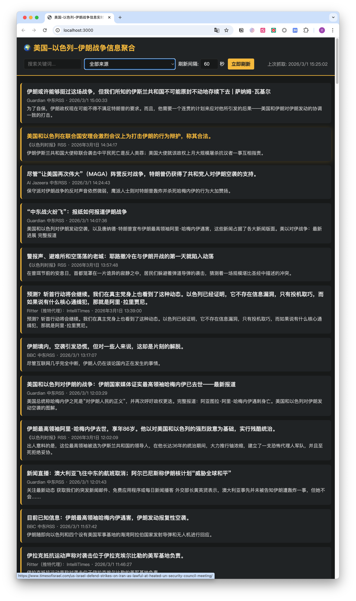

# 美国-以色列-伊朗战争信息实时聚合网站

一键聚合多渠道新闻、Twitter(Nitter)等信息，支持自定义刷新间隔，便于实时追踪最新战局动态。



---

## 功能特性

- **多数据源聚合**：预置 BBC、Guardian、Al Jazeera、Times of Israel、Nitter（Twitter代理）等 RSS/API 渠道
- **自动定时刷新**：默认每 1 分钟自动抓取全部来源（可在页面上配置，最小 10 秒）
- **前端实时展示**：新闻卡片按时间排序，支持关键词搜索、按来源筛选、一键刷新
- **去重存储**：SQLite 数据库自动去重，保证不会重复收录
- **易于扩展**：`data/sources.json` 支持添加新的 RSS/Nitter/HTML 爬虫等数据源

---

## 目录结构

```
iran-war-info/
├── data/
│   └── sources.json      # 数据源配置
│   └── data.db           # SQLite 数据库（运行后自动生成）
├── server/
│   ├── index.js          # Express 主入口
│   ├── db.js             # 数据库操作
│   ├── fetcher.js        # 抓取器
│   └── scheduler.js      # 定时调度
├── public/
│   └── index.html        # 前端页面
├── package.json
└── README.md
```

---

## 快速启动

### 1. 安装依赖

```bash
npm install
```

### 2. 启动服务

```bash
npm start
```

### 3. 访问网站

浏览器打开 [http://localhost:3000](http://localhost:3000)

---

## 配置说明

### 刷新间隔

- 页面右上角可直接修改刷新间隔（秒），最小 10 秒
- 也可通过 API：
  - GET `/api/config` 获取当前配置
  - POST `/api/config` 设置刷新间隔，如 `{"refreshInterval": 30}`

### 数据源配置

编辑 `data/sources.json`，添加或禁用数据源：

```json
{
  "id": "your-source-id",
  "name": "显示名称",
  "type": "rss",           // 支持 rss / nitter / html
  "url": "https://...",
  "enabled": true
}
```

- `type: rss` 适用于标准 RSS/Atom 订阅
- `type: nitter` 适用于 nitter.net 等 Twitter RSS 代理
- `type: html` 可自定义 HTML 爬虫（需扩展 fetcher.js）

---

## API 说明

| 接口 | 方法 | 说明 |
|------|------|------|
| `/api/items` | GET | 获取新闻列表，支持 `source_id`、`search`、`limit`、`offset` 参数 |
| `/api/sources` | GET | 获取所有数据源配置 |
| `/api/health` | GET | 健康检查、上次抓取时间与结果 |
| `/api/fetch` | POST | 手动触发一次全量抓取 |
| `/api/config` | GET/POST | 获取/设置刷新间隔 |

---

## 注意事项

- 部分 RSS 源可能因网络、反爬等原因抓取失败，可在日志中查看详情
- Nitter 实例有时不稳定，如遇抓取失败可更换 nitter 镜像地址
- 如需增加更多 Twitter 账号、官方 API、新闻网站等，请参考 `data/sources.json` 格式添加

---

## 后续扩展建议

- 接入 Twitter/X 官方 API（需申请 API Key）
- 接入更多新闻 API（如 NewsAPI、GNews 等）
- 增加多语言翻译、智能摘要、关键词高亮等功能
- 支持 Telegram/Discord 推送

---

## License

MIT